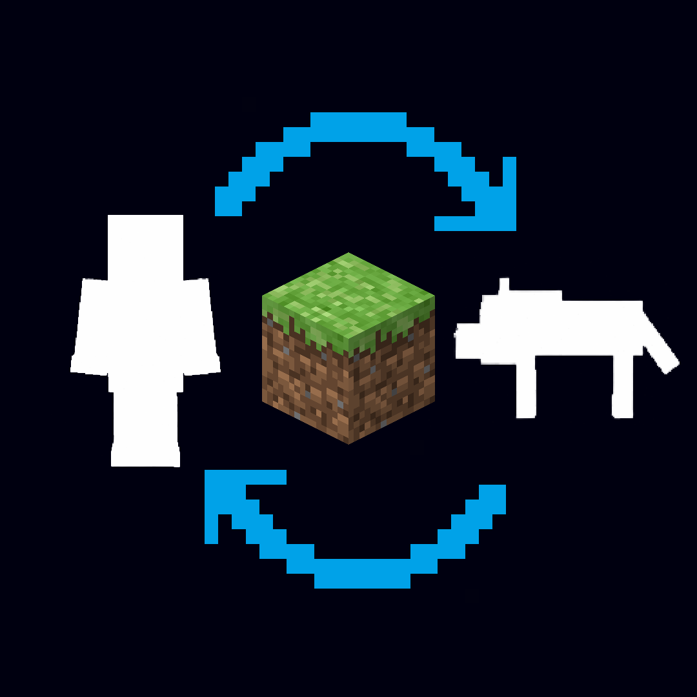

<p align="center">
  
</p>

<h1 align="center">Morph Mod Revived</h1>

<p align="center"><b>Kill a mob, become the mob.</b></p>

<p align="center">
  <a href="https://modrinth.com/mod/morph-mod-revived"></a>
  <a href="https://github.com/ded811/morph-mod-revived"></a>
</p>

<p align="center">
  
  <a href="https://modrinth.com/mod/fabric-api"></a>
  
  
  <a href="LICENSE"></a>
</p>

An unofficial revival of **iChun's Morph**, the classic Minecraft 1.6.4 mod,
rebuilt for **Minecraft 26.2 and 26.3** on **Fabric** and **NeoForge**.

The mobs you kill join your collection. Your body twists into their shape
while everyone nearby watches, and you take on their size and their natural
abilities: bats fly, spiders climb walls, blazes shrug off fire, fish breathe
underwater. Switch between your collected forms whenever you like, or go back
to being yourself. It works on mobs from other mods too, and on other players.

**This is a beta.** It's playable, but it isn't finished, and it isn't an exact
copy of the original. Please report bugs on the
[issue tracker](https://github.com/ded811/morph-mod-revived/issues).

## What you get

- **A collection of forms.** Kill a mob you haven't collected yet and a dark
  copy of it flies into you as you start to change. Variants count separately:
  sheep colours, slime sizes, villager jobs, babies.
- **A selector and a favourites wheel.** Press `[` or `]` to open the selector
  and Enter to change. Hold `` ` `` for a wheel of your starred forms.
- **The mob's body.** Its size, hitbox and passive abilities: flight, slow
  falling, wall climbing, swimming, fire immunity, step-up, poison and Wither
  immunity, monster disguise, and the downsides too, like sunburn and water
  weakness. Your health and attack stay your own.
- **Mobs react to your shape.** Monsters leave you alone while you look like
  one, creepers run from a cat, wolves hunt a sheep.
- **Multiplayer fun.** Other players can ride you as a horse or a happy ghast,
  milk you as a cow, and see every transformation.

The full guide, with every control, ability, command and setting, is on the
[Modrinth page](https://modrinth.com/mod/morph-mod-revived)
([same text here](docs/MODRINTH.md)).

## What you need

- **Minecraft 26.2 or 26.3**, with one of:
  - [**Fabric Loader**](https://fabricmc.net/use/) (0.19.3 or newer for 26.2,
    0.19.5 or newer for 26.3) and [**Fabric API**](https://modrinth.com/mod/fabric-api)
  - [**NeoForge**](https://neoforged.net/) for the same Minecraft version
    (tested with 26.2.0.75, 26.2.0.88, 26.3.0.7-beta and 26.3.0.16-beta). Fabric API isn't needed there.
- Java 25 or newer

Download the file for your loader and your Minecraft version:
`morph-mod-revived-fabric-<version>+mc26.2.jar` is for Fabric on 26.2,
`morph-mod-revived-neoforge-<version>+mc26.3.jar` is for NeoForge on 26.3, and
so on. Each one only works on the loader and the version in its name.
**Ded's API**, the library the mod uses, is inside the jar, so there is
nothing else to download.

On a server, install it on the server **and** on every player's game, using
the same loader on both. A player running NeoForge without the mod can't
join a server that has it. Each loader saves morph collections in its own way,
so a world moved between Fabric and NeoForge loses them.

## Credit

The original **Morph** is by **iChun**: <https://github.com/iChun/Morph>
(branch `legacy` is the 1.6 line this port studied). The idea, the design, the
ability set, the selector, **all of the artwork** and all six transition
sounds are his work. This project ports that work to a modern Minecraft;
everything good about it is his idea.

Not made by, endorsed by, or affiliated with iChun.

## Build it yourself

```
./gradlew build             # Minecraft 26.2, both loaders
./gradlew build -Pmc=26.3   # Minecraft 26.3, both loaders
```

Each build makes both jars and runs the server tests on both loaders. The
jars land in `fabric/build/libs/` and `neoforge/build/libs/`. The client
tests open a game window, so they are separate:
`./gradlew :fabric:runClientGameTest` and `./gradlew :neoforge:runClientGameTest`.

Needs JDK 25. The NeoForge build tools also need a JDK 21, which Gradle
downloads by itself if you don't have one. One set of sources builds both
loaders and both Minecraft versions: `common/` holds the shared code,
`fabric/` and `neoforge/` the parts for each loader, and
[`versions/README.md`](versions/README.md) explains how the versions work.

## Licence

**LGPL-3.0-only.** The original is LGPL-3.0, so this port is too. The
bundled Ded's API contains none of the original's code, but its author has put
it under the LGPL-3.0 as well. The licence is two documents:
[`LICENSE`](LICENSE) (the LGPL-3.0) and [`LICENSE.GPL`](LICENSE.GPL) (the
GPL-3.0 it incorporates). See [`NOTICE`](NOTICE) for attribution, the
statement of changes, the asset position, and who holds the copyright in which
part.

If you redistribute a built jar, keep `LICENSE`, `LICENSE.GPL` and `NOTICE`
with it and make the matching source available. A link to this repository
does that for an unchanged jar; if you changed anything, say so with a date
and publish your changed source. Shipping only Ded's API inside your own mod
does not put your mod under the LGPL; see NOTICE section 6.
